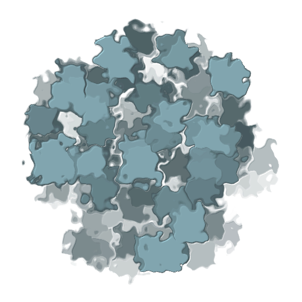

<p align="center">
  
  <h3 align="center">swarm</h3>
  <p align="center"><strong>Go channels for queueing systems</strong></p>

  <p align="center">
    <!-- Documentation -->
    <a href="http://godoc.org/github.com/fogfish/swarm">
      
    </a>
    <!-- Build Status  -->
    <a href="https://github.com/fogfish/swarm/actions/">
      
    </a>
    <!-- GitHub -->
    <a href="http://github.com/fogfish/swarm">
      
    </a>
    <!-- Coverage -->
    <a href="https://coveralls.io/github/fogfish/swarm?branch=main">
      
    </a>
    <!-- Go Card -->
    <a href="https://goreportcard.com/report/github.com/fogfish/swarm">
      
    </a>
    <!-- Maintainability -->
    <a href="https://codeclimate.com/github/fogfish/swarm/maintainability">
      
    </a>
  </p>
</p>

---

Today's wrong abstractions lead to complexity on maintainability in the future. Usage of synchronous interfaces to reflect asynchronous nature of messaging queues is a good example of inaccurate abstraction. Usage of pure Go channels is a proper solution to distills asynchronous semantic of queues into the idiomatic native Golang code.

## Inspiration

See [design pattern](./doc/pattern.md) to learn how to improve:

1. **readability**: application uses idiomatic Go code instead of vendor specific interfaces (learning time) 
2. **portability**: application is portable between various queuing systems in same manner as sockets abstracts networking stacks. (exchange tech stack, Develop against an in-memory)
3. **testability**: (unit tests with no dependencies)

<!-- TODO: Update inspiration -->

## Getting started

The latest version of the library is available at `main` branch of this repository. All development, including new features and bug fixes, take place on the `main` branch using forking and pull requests as described in contribution guidelines. The stable version is available via Golang modules.

```go
import (
  "github.com/fogfish/swarm"
  "github.com/fogfish/swarm/queue/sqs"
)

// spawn queue client
sys := swarm.New("test")
queue := swarm.Must(sqs.New(sys, "some-queue"))

// get Go channel to emit messages into queue
snd, _ := queue.Send("message-of-type-a")
snd <- swarm.Bytes("{\"type\": \"a\", \"some\": \"message\"}")

// get Go channel to recv messages from queue
rcv, ack := queue.Recv("message-of-type-a")
for msg := range rcv {
  // do something with message
  ack <- msg
}

sys.Stop()
```

See [examples](example) folder for executable examples and code snippets for your projects.

## Supported queues

- [x] Ephemeral (in-memory) built-in queue
  - [ ] 
- [x] AWS EventBridge
  - [x] [sending message](example/eventbridge/send/eventbridge.go)
  - [x] [receiving message](example/eventbridge/recv/eventbridge.go) through lambda handler
- [x] AWS SQS
  - [x] [sending message](example/sqs/send/sqs.go)
  - [ ] receiving message through lambda handler
  - [x] [receiving message](example/sqs/recv/sqs.go)
- [ ] AWS SNS
  - [ ] sending message
- [ ] AWS Kinesis
  - [ ] sending message
  - [ ] receiving message through lambda handler
  - [ ] receiving message
- [ ] Redis
  - [ ] sending message
  - [ ] receiving message
- [ ] MQTT API
  - [ ] sending message
  - [ ] receiving message

Please let us know via [GitHub issues](https://github.com/fogfish/swarm/issue) your needs about queuing technologies.


## How To Contribute

The library is [Apache Version 2.0](LICENSE) licensed and accepts contributions via GitHub pull requests:

1. Fork it
2. Create your feature branch (`git checkout -b my-new-feature`)
3. Commit your changes (`git commit -am 'Added some feature'`)
4. Push to the branch (`git push origin my-new-feature`)
5. Create new Pull Request

The build and testing process requires [Go](https://golang.org) version 1.16 or later.

**build** and **test** library.

```bash
git clone https://github.com/fogfish/swarm
cd swarm
go test ./...
```

### commit message

The commit message helps us to write a good release note, speed-up review process. The message should address two question what changed and why. The project follows the template defined by chapter [Contributing to a Project](http://git-scm.com/book/ch5-2.html) of Git book.

### bugs

If you experience any issues with the library, please let us know via [GitHub issues](https://github.com/fogfish/swarm/issue). We appreciate detailed and accurate reports that help us to identity and replicate the issue. 

### benchmarking

```bash
cd queue/sqs
go test -run=^$ -bench=. -benchtime 100x
```


## How To Abstract Queue

TBD
<!-- TODO -->

## License

[](LICENSE)

