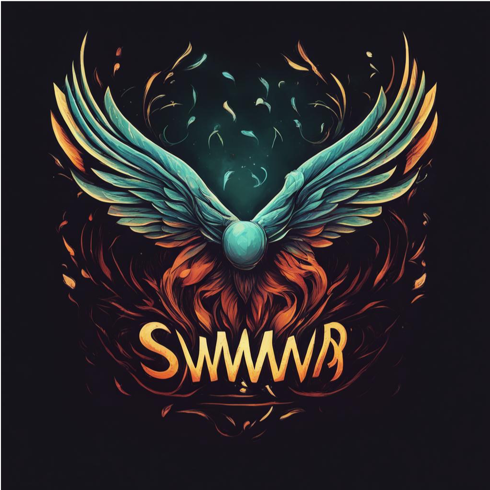

<p align="center">
  
  <h3 align="center">swarm</h3>
  <p align="center"><strong>Go channels for distributed queueing and event-driven systems</strong></p>

  <p align="center">
    <!-- Version -->
    <a href="https://github.com/fogfish/swarm/tags">
      
    </a>
    <!-- Documentation -->
    <a href="http://godoc.org/github.com/fogfish/swarm">
      
    </a>
    <!-- Build Status  -->
    <a href="https://github.com/fogfish/swarm/actions/">
      
    </a>
    <!-- GitHub -->
    <a href="http://github.com/fogfish/swarm">
      
    </a>
    <!-- Coverage -->
    <a href="https://coveralls.io/github/fogfish/swarm?branch=main">
      
    </a>
    <!-- Go Card -->
    <a href="https://goreportcard.com/report/github.com/fogfish/swarm">
      
    </a>
  </p>
</p>

---

Today's wrong abstractions lead to complexity on maintainability in the future. Usage of synchronous interfaces to reflect asynchronous nature of messaging queues is a good example of inaccurate abstraction. Usage of pure Go channels is a proper solution to distills asynchronous semantic of queueing systems into the idiomatic native Golang code. The library adapts Go channels for various systems and interface. 

api | examples 
--- | --- 
AWS EventBridge  |
 || [aws cdk](examples/eventbridge/serverless/main.go)
 || [enqueue](examples/eventbridge/enqueue/eventbridge.go)
 || [dequeue](examples/eventbridge/dequeue/eventbridge.go)
AWS SQS  | 
 || [aws cdk](examples/eventsqs/serverless/main.go)
 || [enqueue](examples/eventsqs/enqueue/eventsqs.go)
 || [dequeue](examples/eventsqs/dequeue/eventsqs.go)
AWS SQS | 
 || [enqueue](examples/sqs/enqueue/sqs.go)
 || [dequeue](examples/sqs/dequeue/sqs.go)
AWS SNS  |
 || enqueue 
AWS S3 Event  |
 || [aws cdk](./examples/events3/serverless/main.go)
 || [dequeue](./examples/events3/dequeue/events3.go)
AWS DynamoDB Streams  |
 || [aws cdk](./examples/eventddb/serverless/main.go)
 || [dequeue](./examples/eventddb/dequeue/eventddb.go)
AWS WebSocket API  |
 || [aws cdk](./examples/websocket/serverless/main.go)
 || [dequeue](./examples/websocket/dequeue/websocket.go)
AWS Kinesis    |
 || aws cdk
 || enqueue
 || dequeue
AWS Kinesis  |
 || enqueue
 || dequeue
AWS Redis  |
MQTT API  |


## Inspiration

The library encourages developers to use Golang struct for asynchronous communication with peers. It helps engineers to define domain models, write correct, maintainable code. This library (`swarm`) uses generic programming style to abstract queueing systems into the idiomatic Golang channels `chan<- T` and `<-chan T`. See the design pattern [Golang channels for distributed event-driven architecture](./doc/pattern.md) to learn philosophy and use-cases:
1. **readability**: application uses pure Go code instead of vendor specific interfaces (learning time) 
2. **portability**: application is portable between various queuing systems or event brokers in same manner as sockets abstracts networking stacks (exchange queueing transport "on-the-fly" to resolve evolution of requirements)  
3. **testability**: unit testing focuses on pure biz logic, simplify dependency injections and mocking (pure unit tests).  
4. **distribution**: idiomatic architecture to build distributed topologies and scale-out Golang applications (clustering).
5. **serverless**: of-the-shelf portable patterns for serverless applications (infrastructure as a code, aws cdk).

## Getting started

The library requires **Go 1.18** or later due to usage of [generics](https://go.dev/blog/intro-generics).

The latest version of the library is available at `main` branch of this repository. All development, including new features and bug fixes, take place on the `main` branch using forking and pull requests as described in contribution guidelines. The stable version is available via Golang modules.

Use `go get` to retrieve the library and add it as dependency to your application.

```bash
go get -u github.com/fogfish/swarm
```

- [Getting Started](#getting-started)
  - [Produce (enqueue) messages](#produce-enqueue-messages)
  - [Consume (dequeue) messages](#consume-dequeue-messages)
  - [Configure library behavior](#configure-library-behavior)
  - [Message Delivery Guarantees](#message-delivery-guarantees)
  - [Delayed Guarantee vs Guarantee](#delayed-guarantee-vs-guarantee)
  - [Order of Messages](#order-of-messages)
  - [Octet streams](#octet-streams)
  - [Generic events](#generic-events)
  - [Error handling](#error-handling)
  - [Fail Fast](#fail-fast)
  - [Internal channel architecture](#internal-channel-architecture)
  - [Serverless](#serverless)
  - [Supported queuing system and event brokers](#supported-queuing-system-and-event-brokers)

### Produce (enqueue) messages

Please [see and try examples](examples). Its cover all basic use-cases with runnable code snippets, check the design pattern [Distributed event-driven Golang channels](./doc/pattern.md) for deep-dive into library philosophy.

The following code snippet shows a typical flow of producing the messages using the library.

```go
import (
  "github.com/fogfish/swarm/broker/sqs"
  "github.com/fogfish/swarm/queue"
)

// Use pure Golang struct to define semantic of messages and events
type Note struct {
  ID   string `json:"id"`
  Text string `json:"text"`
}

// Spawn a new instance of the messaging broker
q := swarm.Must(sqs.New("name-of-the-queue"), /* config options */)

// creates pair Golang channels dedicated for publishing
// messages of type Note through the messaging broker. The first channel
// is dedicated to emit messages. The second one is the dead letter queue that
// contains failed transmissions. 
enq, dlq := queue.Enqueue[Note](q)

// Enqueue message of type Note
enq <- Note{ID: "note", Text: "some text"}

// Close the broker and release all resources
q.Close()
```

### Consume (dequeue) messages

Please [see and try examples](examples). Its cover all basic use-cases with runnable code snippets, check the design pattern [Distributed event-driven Golang channels](./doc/pattern.md) for deep-dive into library philosophy.

The following code snippet shows a typical flow of consuming the messages using the library.

```go
import (
  "github.com/fogfish/swarm/broker/sqs"
  "github.com/fogfish/swarm/queue"
)

// Use pure Golang struct to define semantic of messages and events
type Note struct {
  ID   string `json:"id"`
  Text string `json:"text"`
}

// Spawn a new instance of the messaging broker
q := swarm.Must(sqs.New("name-of-the-queue", /* config options */))

// Create pair Golang channels dedicated for consuming
// messages of type Note from the messaging broker. The first channel
// is dedicated to receive messages. The second one is the channel to
// acknowledge consumption  
deq, ack := queue.Dequeue[Note](q)

// consume messages and then acknowledge it
for msg := range deq {
  /* ... do something with msg.Object ...*/
  ack <- msg
}

// Await messages from the broker
q.Await()
```

### Configure library behavior

The library uses "option pattern" for the configuration. See all available [configuration options](./config.go), which are passed into the broker. Please note that each configuration options has `With` prefix:

```go
q, err := sqs.New("name-of-the-queue",
  swarm.WithSource("name-of-my-component"),
  swarm.WithRetryConstant(10 * time.Millisecond, 3),
  swarm.WithPollFrequency(10 * time.Second),
  /* ... */
)
```

### Message Delivery Guarantees

Usage of Golang channels as an abstraction raises a concern about grade of service on the message delivery guarantees. The library ensures exactly same grade of service as the underlying queueing system or event broker. Messages are delivered according to the promise once they are accepted by the remote side of queuing system. The library's built-in retry logic protects losses from temporary unavailability of the remote peer. However, Golang channels are sophisticated "in-memory buffers", which introduce a lag of few milliseconds between scheduling a message to the channel and dispatching message to the remote peer. Use one of the following policy to either accept or protect from the loss all the in-the-flight messages in case of catastrophic failures.

**At Most Once** is best effort policy, where a message is published without any formal acknowledgement of receipt, and it isn't replayed. Some messages can be lost as subscribers are not required to acknowledge receipt.  

The library implements asymmetric approaches. The **enqueue** path uses buffered Golang channels for emitter and dead-letter queues. The **dequeue** path also uses buffered Golang channels for delivery message to consumer. The messages are automatically acknowledged to the broker upon successful scheduling. This means that information will be lost if the consumer crashes before it has finished processing the message. 

```go
// Spawn a new instance of the messaging broker using At Most Once policy.
// The policy defines the capacity of Golang channel.
q, err := sqs.New("name-of-the-queue",
  swarm.WithPolicyAtMostOnce(1000),
)

// for compatibility reasons two channels are returned on the enqueue path but
// dead-letter-queue is nil
enq, dlq := queue.Enqueue[Note](q)

// for compatibility reasons two channels are returned on the dequeue path but
// ack channel acts as /dev/null discards any sent message
deq, ack := queue.Dequeue[Note](q)
```

**At Least Once** is the default policy used by the library. The policy assume usage of "acknowledgement" protocol, which guarantees a message will be re-sent until it is formally acknowledged by a recipient. Messages should never be lost but it might be delivered more than once causing duplicate work to consumer.  

The library implements also asymmetric approaches. The **enqueue** path uses unbuffered Golang channels to emit messages and handle dead-letter queue, which leads to a delayed guarantee. The delayed guarantee in this context implies that enqueueing of other messages is blocked until dead-letter queue is resolved. Alternatively, the application can use synchronous protocol to enqueue message. The **dequeue** path also uses unbuffered Golang channels for delivery message to consumer and acknowledge its processing. The acknowledgement of message by consumer guarantee reliable delivery of the message but might cause duplicates. 

```go
// Spawn a new instance of the messaging broker using At Least Once policy.
// At Least Once policy is the default one, no needs to explicitly declare it.
// Use it only if you need to define other capacity for dequeue channel than
// the default one, which creates unbuffered channel
q, err := sqs.New("name-of-the-queue",
  swarm.WithPolicyAtLeastOnce(1000),
)

// both channels are unbuffered
enq, dlq := queue.Enqueue[Note](q)

// buffered channels of capacity n
deq, ack := queue.Dequeue[Note](q)
```

**Exactly Once** is not supported by the library yet.


### Delayed Guarantee vs Guarantee

Usage of "At Least Once" policy (unbuffered channels) provides the delayed guarantee for producers. Let's consider the following example. If queue broker fails to send message `A` then the channel `enq` is blocked at sending message `B` until the program consumes message `A` from the dead-letter queue channel.

```go
enq, dlq := queue.Enqueue[*User](q)

enq <- &User{ID: "A", Text: "some text by A"} // failed to send
enq <- &User{ID: "B", Text: "some text by B"} // blocked until dlq is processed 
enq <- &User{ID: "C", Text: "some text by C"}
```

The delayed guarantee is efficient on batch processing, pipelining but might cause complication at transactional processing. Therefore, the library also support a synchronous variant to producing a message:

```go
// Creates "synchronous" variant of the queue
user := queue.New[User](q)

// Synchronously enqueue the message. It ensure that message is scheduled for
// delivery to remote peer once function successfully returns.
if err := user.Put(&User{ID: "A", Text: "some text by A"}); err != nil {
  // handle error
}
```

### Order of Messages

The library guarantee ordering of the messages when they are produced over same Golang channel. Let's consider a following example:

```go
user, _ := queue.Enqueue[*User](q)
note, _ := queue.Enqueue[*Note](q)

user <- &User{ID: "A", Text: "some text by A"}
note <- &Note{ID: "B", Text: "some note A"}
user <- &User{ID: "C", Text: "some text by A"}
```

The library guarantees following clauses `A before C` and `C after A` because both messages are produced to single channel `user`. It do not guarantee clauses `A before B`, `B before C` or `C after B` because multiple channels are used.

The library does not provide any higher guarantee than underlying message broker. For example, using SQS would not guarantee any ordering while SQS FIFO makes sure that messages of same type is ordered.


### Octet Streams

The library support slices of bytes `[]byte` as message type. It opens an opportunity for the many encoding options like JSON, Gob, etc.  

```go
import (
  queue "github.com/fogfish/swarm/queue/bytes"
)

enq, dlq := queue.Enqueue(q, "Note")
deq, ack := queue.Dequeue(q, "Note")
```

Please see example about [binary](./examples/bytes) consumer/producer.

### Generic events

Event defines immutable fact(s) placed into the queueing system.
Event resembles the concept of [Action](https://schema.org/Action) as it is defined by schema.org.

> An action performed by a direct agent and indirect participants upon a direct object.

This type supports development of event-driven solutions that treat data as
a collection of immutable facts, which are queried and processed in real-time.
These applications processes logical log of events, each event defines a change
to current state of the object, i.e. which attributes were inserted,
updated or deleted (a kind of diff). The event identifies the object that was
changed together with using unique identifier.

The library support this concept through generic type `swarm.Event[T]` using [the Higher-Kinded Type Classes abstraction](https://github.com/fogfish/golem/blob/main/doc/typeclass.md). This abstraction allows to "overload" well-defined behavior of `swarm.Event[T]` with application specific type:

```go
import (
  "github.com/fogfish/swarm"
  queue "github.com/fogfish/swarm/queue/events"
)

// declares the application specific event type.
type EventCreateNote swarm.Event[*Note]

func (EventCreateNote) HKT1(swarm.EventType) {}
func (EventCreateNote) HKT2(*Note)           {}

// creates Golang channels to produce / consume messages
enq, dlq := queue.Enqueue[*Note, EventCreateNote](q)
deq, ack := queue.Dequeue[*Note, EventCreateNote](q)
```

Please see example about [event-driven](./examples/events/) consumer/producer.

### Error Handling

The error handling on channel level is governed either by [dead-letter queue](#message-delivery-guarantees) or [acknowledge protocol](#consume-dequeue-messages). The library provides `swarm.WithStdErr` configuration option to pass the side channel to consume global errors. Use it as top level error handler. 

```go
stderr := make(chan error)
q := queue.Must(sqs.New("swarm-test", swarm.WithStdErr(stderr)))

for err := range stderr {
  // error handling loop
}
```

### Fail Fast

Existing message routing architecture assumes that micro-batch of messages is read from broker. These messages are dispatched to channels and it waits for acks. New micro-batch is not read until all messages are acknowledged or `TimeToFlight` timer is expired. In the time critical system or serverless application "fail fast" is the best strategy (e.g. lambda function does not need to idle for timeout).

Send negative acknowledgement to `ack` channel to indicate error on message processing.

```go
deq, ack := queue.Dequeue[Note](q)

// consume messages and then acknowledge it
for msg := range deq {
  // negative ack on the error
  if err := doSomething(msg.Object); err != nil {
    ack <- msg.Fail(err)
    continue
  } 
  ack <- msg
}
```


### Serverless 

The library support development of serverless event-driven application using AWS service. The library provides AWS CDK Golang constructs to spawn consumers. See example of [serverless consumer](./examples/eventbridge/dequeue/eventbridge.go) and corresponding AWS CDK [application](./examples/eventbridge/serverless/main.go).

```go
package main

import (
  "github.com/fogfish/scud"
  "github.com/fogfish/swarm/queue/eventbridge"
)

func main() {
  app := eventbridge.NewServerlessApp()

  stack := app.NewStack("swarm-example-eventbridge")
  stack.NewEventBus()

  stack.NewSink(
    &eventbridge.SinkProps{
      Source: []string{"swarm-example-eventbridge"},
      Lambda: &scud.FunctionGoProps{
        SourceCodePackage: "github.com/fogfish/swarm",
        SourceCodeLambda:  "examples/eventbridge/dequeue",
      },
    },
  )

  app.Synth(nil)
}
```

Note: **AWS Event Bridge** has a feature that allows to [match execution of consumer to the pattern](https://docs.aws.amazon.com/AmazonCloudWatch/latest/events/CloudWatchEventsandEventPatterns.html#CloudWatchEventsPatterns) of JSON object. Use `swarm.Event[T]` type to build reliable matching of incoming events:

```go
/*
enq <- &swarm.Event[*User]{
  Agent:  "swarm:example",
  Participant: "user",
  Object: &User{ID: "user", Text: "some text"},
}
*/

stack.NewSink(
  &eventbridge.SinkProps{
    Pattern: map[string]interface{}{
      "@type": []string{"[user:Event[*swarm.User]]"},
      "agent": []string{"[swarm:example]"},
      "participant": []string{"[user]"},
    },
    /* ... */
  },
)
```

### Supported queuing system and event brokers 


Please let us know via [GitHub issues](https://github.com/fogfish/swarm/issue) your needs about queuing technologies.


## How To Contribute

The library is [Apache Version 2.0](LICENSE) licensed and accepts contributions via GitHub pull requests:

1. Fork it
2. Create your feature branch (`git checkout -b my-new-feature`)
3. Commit your changes (`git commit -am 'Added some feature'`)
4. Push to the branch (`git push origin my-new-feature`)
5. Create new Pull Request

The build and testing process requires [Go](https://golang.org) version 1.16 or later.

**build** and **test** library.

```bash
git clone https://github.com/fogfish/swarm
cd swarm
go test ./...
```

### commit message

The commit message helps us to write a good release note, speed-up review process. The message should address two question what changed and why. The project follows the template defined by chapter [Contributing to a Project](http://git-scm.com/book/ch5-2.html) of Git book.

### bugs

If you experience any issues with the library, please let us know via [GitHub issues](https://github.com/fogfish/swarm/issue). We appreciate detailed and accurate reports that help us to identity and replicate the issue. 

### benchmarking

```bash
cd queue/sqs
go test -run=^$ -bench=. -benchtime 100x
```


## Bring Your Own Queue

TBD

## License

[](LICENSE)

