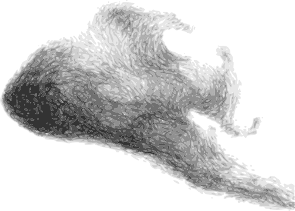

<p align="center">
  
  <h3 align="center">swarm</h3>
  <p align="center"><strong>Go channels for queueing systems</strong></p>

  <p align="center">
    <!-- Documentation -->
    <a href="http://godoc.org/github.com/fogfish/swarm">
      
    </a>
    <!-- Build Status  -->
    <a href="https://github.com/fogfish/swarm/actions/">
      
    </a>
    <!-- GitHub -->
    <a href="http://github.com/fogfish/swarm">
      
    </a>
    <!-- Coverage -->
    <a href="https://coveralls.io/github/fogfish/swarm?branch=main">
      
    </a>
    <!-- Go Card -->
    <a href="https://goreportcard.com/report/github.com/fogfish/swarm">
      
    </a>
    <!-- Maintainability -->
    <a href="https://codeclimate.com/github/fogfish/swarm/maintainability">
      
    </a>
  </p>
</p>

---

Today's wrong abstractions lead to complexity on maintainability in the future. Usage of synchronous interfaces to reflect asynchronous nature of messaging queues is a good example of inaccurate abstraction. Usage of pure Go channels is a proper solution to distills asynchronous semantic of queues into the idiomatic native Golang code.

## Inspiration

See [design pattern](./doc/pattern.md) to learn how to improve:

1. **readability**: application uses pure Go code instead of vendor specific interfaces (learning time) 
2. **portability**: application is portable between various queuing systems in same manner as sockets abstracts networking stacks (exchange queueing transport "on-the-fly" to resolve evolution of requirements)  
3. **testability**: unit testing focuses on pure biz logic, simplify dependency injections and mocking (pure unit tests).  
4. **distribution**: idiomatic architecture to build distributed topologies and scale-out Golang applications (clustering).
5. **serverless**: of-the-shelf portable patterns for serverless applications (aws cdk).

## Getting started

The library requires **Go 1.18** or later due to usage of [generics](https://go.dev/blog/intro-generics).

The latest version of the library is available at `main` branch of this repository. All development, including new features and bug fixes, take place on the `main` branch using forking and pull requests as described in contribution guidelines. The stable version is available via Golang modules.

The latest version of the library is available at `main` branch. All development, including new features and bug fixes, take place on the `main` branch using forking and pull requests as described in contribution guidelines. The stable version is available via Golang modules.

1. Use `go get` to retrieve the library and add it as dependency to your application.

```bash
go get -u github.com/fogfish/swarm
```

2. Import required package in your code

```go
import (
  "github.com/fogfish/swarm/queue"
  "github.com/fogfish/swarm/queue/sqs" // <-- replace with your queue 
)
```

### Quick Example

```go
import (
  "github.com/fogfish/swarm/queue"
  "github.com/fogfish/swarm/queue/sqs"
)

// Use pure Golang struct to define events and messages in the app
type Note struct {
  ID   string `json:"id"`
  Text string `json:"text"`
}

// Create instance of the client to queueing system, for example AWS SQS
sys := sqs.NewSystem("swarm-example-sqs")
q := sqs.Must(sqs.New(sys, "swarm-test"))

// Get Go channel to emit messages into queue and receive failed messages
enq, dlq := queue.Enqueue[Note](q)

// Get Go channel to recv messages from queue and acknowledge them
deq, ack := queue.Dequeue[Note](q)

// Spawn queue listeners. At this point the system spawns the transport
// routines so that channels are ready for the communications
if err := sys.Listen(); err != nil {
  panic(err)
}

// Enqueue message to the queue
enq <- Note{ID: "note", Text: "some text"}

// Dequeue message from queue
for msg := range deq {
  // do something with message and then acknowledge it
  ack <- msg
}

sys.Stop()
```

See [examples](examples) folder for executable examples, code snippets for your projects and receipts to build serverless applications.

## Getting started with serverless

See [example of serverless event consumer](examples/eventbridge/serverless/main.go). The library provides AWS CDK Golang constructs to spawn consumers.

```go
package main

import (
  "github.com/fogfish/scud"
  "github.com/fogfish/swarm/queue/eventbridge"
)

func main() {
  eventbridge.NewServerlessApp("swarm-example-eventbridge").
    CreateEventBus().
    CreateSink(
      &eventbridge.SinkProps{
        Queue: "swarm-test",
        Lambda: &scud.FunctionGoProps{
          SourceCodePackage: "github.com/fogfish/swarm",
          SourceCodeLambda:  "examples/eventbridge/recv",
        },
      },
    ).
    Synth(nil)
}
```

## Supported queues

- [x] AWS EventBridge
  - [x] [sending message](examples/eventbridge/send/eventbridge.go)
  - [x] [receiving message](examples/eventbridge/recv/eventbridge.go) using aws lambda
  - [x] [aws cdk construct](examples/eventbridge/serverless/main.go)
- [x] AWS SQS Serverless
  - [x] [sending message](examples/eventsqs/send/eventsqs.go)
  - [x] [receiving message](examples/eventsqs/recv/eventsqs.go) using aws lambda
  - [x] [aws cdk construct](examples/eventsqs/serverless/main.go)
- [x] AWS SQS
  - [x] [sending message](examples/sqs/send/sqs.go)
  - [x] [receiving message](examples/sqs/recv/sqs.go)
- [ ] AWS SNS
  - [ ] sending message
- [ ] AWS Kinesis
  - [ ] sending message
  - [ ] receiving message through lambda handler
  - [ ] receiving message
- [ ] Redis
  - [ ] sending message
  - [ ] receiving message
- [ ] MQTT API
  - [ ] sending message
  - [ ] receiving message

Please let us know via [GitHub issues](https://github.com/fogfish/swarm/issue) your needs about queuing technologies.


## How To Contribute

The library is [Apache Version 2.0](LICENSE) licensed and accepts contributions via GitHub pull requests:

1. Fork it
2. Create your feature branch (`git checkout -b my-new-feature`)
3. Commit your changes (`git commit -am 'Added some feature'`)
4. Push to the branch (`git push origin my-new-feature`)
5. Create new Pull Request

The build and testing process requires [Go](https://golang.org) version 1.16 or later.

**build** and **test** library.

```bash
git clone https://github.com/fogfish/swarm
cd swarm
go test ./...
```

### commit message

The commit message helps us to write a good release note, speed-up review process. The message should address two question what changed and why. The project follows the template defined by chapter [Contributing to a Project](http://git-scm.com/book/ch5-2.html) of Git book.

### bugs

If you experience any issues with the library, please let us know via [GitHub issues](https://github.com/fogfish/swarm/issue). We appreciate detailed and accurate reports that help us to identity and replicate the issue. 

### benchmarking

```bash
cd queue/sqs
go test -run=^$ -bench=. -benchtime 100x
```


## How To Abstract Queue

TBD
<!-- TODO -->

## License

[](LICENSE)

